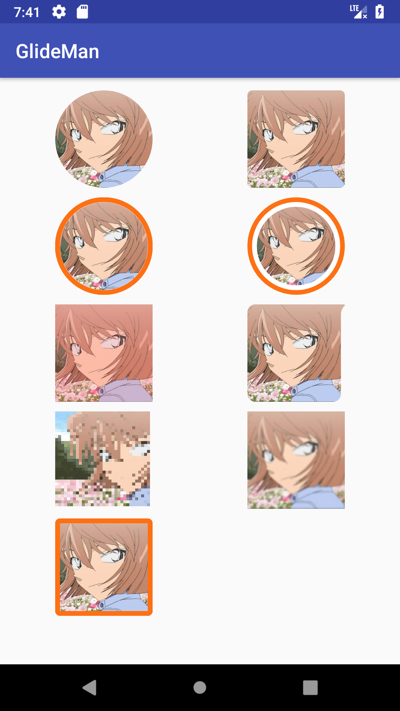

# GlideMan

> Easier to use Glide Transformation!

[](https://github.com/Werb/MoreType/blob/master/LICENSE)
 [  ](https://bintray.com/werbhelius/maven/glideman/_latestVersion)
 [](https://android-arsenal.com/api?level=19)

 ## Dependency
 ```gradle
implementation 'com.werb.glideman:glideman:0.2.0'
```

## Preview


## Use
[CircleTransformation](https://github.com/Werb/GlideMan/blob/master/app/src/main/kotlin/com/werb/glideman/demo/ImageViewHolder.kt#L21)

[RoundTransformation](https://github.com/Werb/GlideMan/blob/master/app/src/main/kotlin/com/werb/glideman/demo/ImageViewHolder.kt#L24)

[CircleBorderTransformation](https://github.com/Werb/GlideMan/blob/master/app/src/main/kotlin/com/werb/glideman/demo/ImageViewHolder.kt#L27)

[CircleBorderWithPaddingTransformation](https://github.com/Werb/GlideMan/blob/master/app/src/main/kotlin/com/werb/glideman/demo/ImageViewHolder.kt#L30)

[MaskColorTransformation](https://github.com/Werb/GlideMan/blob/master/app/src/main/kotlin/com/werb/glideman/demo/ImageViewHolder.kt#L37)

[MaskShapeTransformation](https://github.com/Werb/GlideMan/blob/master/app/src/main/kotlin/com/werb/glideman/demo/ImageViewHolder.kt#L40)

[PixelTransformation](https://github.com/Werb/GlideMan/blob/master/app/src/main/kotlin/com/werb/glideman/demo/ImageViewHolder.kt#L43)

[BlurTransformation](https://github.com/Werb/GlideMan/blob/master/app/src/main/kotlin/com/werb/glideman/demo/ImageViewHolder.kt#L46)

[RoundBorderTransformation](https://github.com/Werb/GlideMan/blob/master/app/src/main/kotlin/com/werb/glideman/demo/ImageViewHolder.kt#L49)

[RoundDetailTransformation](https://github.com/Werb/GlideMan/blob/master/app/src/main/kotlin/com/werb/glideman/demo/ImageViewHolder.kt#L52)